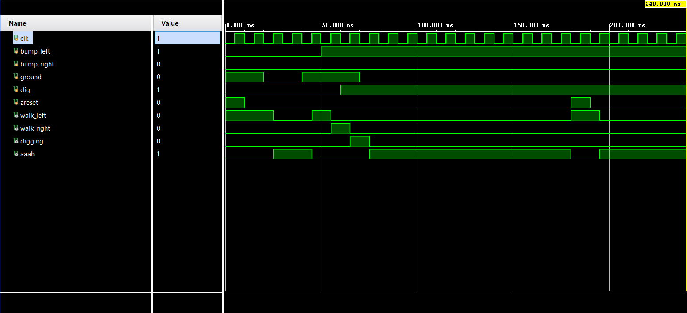

# Lemmings FSM in Verilog

This is an implementation of finite state machine (FSM) based on the **Lemmings** logic using Verilog and simulation using Xilinx Vivado.

## Lemmings Logic

In the 2D world Lemmings can walk,fall and dig.. It can switch direction according to obstacles (right and left).The ground input determines when it should fall and the dig input determines when it should dig.If they fall more than 20 clock cycles it will splatter and cease walking and all the four outputs become zero.

### State Diagram

## Project Structure

`src/`: Contains the Verilog code file.   
`project_lemmings.srcs`:FPGA constraint file(.xpc).  
`images/`: Output waveform and state diagram.   
`project_lemmings/`: The Vivado project file.

## How to run 

- Open the Vivado project file (.xpr).
- Run simulation -> Run Behavioural Simulation.
- View Waveform in the waveform window.
- (Optional) Run synthesis -> Run Implementation -> Generate Bitstream.

## Output Waveform

## How to Open in Vivado

1. Clone the repo:
2. Open **Vivado**
3. Go to **File > Open Project**
4. Select `project_lemmings.xpr`
